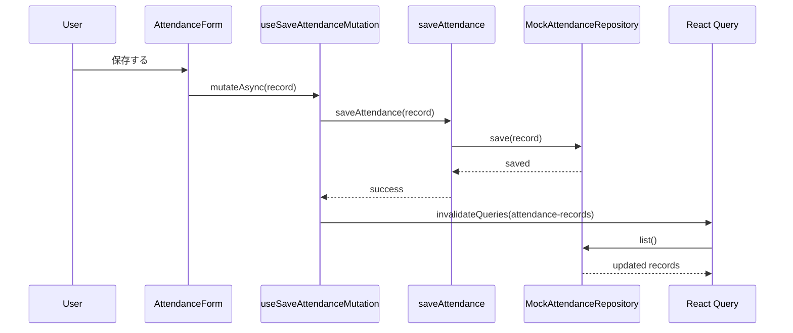

# API Design

## 前提

現時点ではバックエンド未接続であり、画面は Mock Repository を通じてデータを取得・保存している。
このドキュメントは、現在の Port 定義を基準にした API 境界の設計メモである。
Mock 実装では保存・取得に短い待機時間を入れ、ローディングや保存中状態の UI を確認できるようにしている。

## 現在の業務データ

### User

```ts
interface User {
  id: string;
  employeeCode: string;
  name: string;
  email: string;
}
```

### AttendanceRecord

```ts
interface AttendanceRecord {
  date: string;
  scheduledStartAt: string;
  scheduledEndAt: string;
  actualStartAt: string;
  actualEndAt: string;
  breakMinutes: number;
  note: string;
}
```

## 現在の Port

### AuthRepository

```ts
getCurrentUser(): Promise<User | null>
```

### AttendanceRepository

```ts
save(record: AttendanceRecord): Promise<void>
list(): Promise<AttendanceRecord[]>
```

## 勤怠保存フロー



## 想定 API エンドポイント

### ログインユーザ

- `GET /api/auth/me`

想定レスポンス:

```json
{
  "id": "user-001",
  "employeeCode": "EMP001",
  "name": "Taro Yamada",
  "email": "taro@example.com"
}
```

### 勤怠一覧

- `GET /api/attendance`

将来的なクエリ候補:

- `from`
- `to`
- `employeeId`
- `hasAnomaly`

### 勤怠保存

現時点の UI は「対象日付の勤怠を 1 件保存する」前提なので、以下のどちらかが候補になる。

- `POST /api/attendance`
- `PUT /api/attendance/:date`

保存リクエスト例:

```json
{
  "date": "2026-03-30",
  "scheduledStartAt": "09:00",
  "scheduledEndAt": "18:00",
  "actualStartAt": "09:05",
  "actualEndAt": "18:10",
  "breakMinutes": 60,
  "note": "Initial mock data"
}
```

## エラーハンドリング方針

- API レイヤでは `httpClient` が `response.ok` を評価する
- 失敗時は `ApiError` を投げる
- React Query 側では `status < 500` の `ApiError` は再試行しない
- mutation は現時点で retry なし

## 今後の API 設計課題

- レポート検索クエリの定義
- 勤怠保存時のバリデーションエラー仕様
- 認証切れ時の共通リダイレクト戦略
- 異常検知 API をサーバで計算するか、フロントで判定するかの分担
