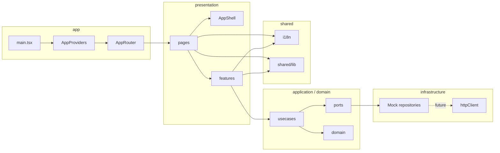
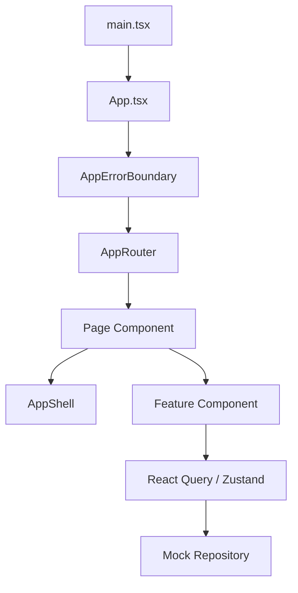

# Architecture

## 目的

Workforce Manager は、勤怠管理の UI と業務ロジックを段階的に追加するために、Hexagonal Architecture を前提としたフロントエンド構成を採用している。  
現時点ではバックエンド未接続のため、Infrastructure 層は Mock Repository で代替している。

## 全体構成図

## 画面形成フロー

## レイヤ構成

### `app`

- アプリ起動
- Provider 注入
- Router 定義

主な責務:

- `main.tsx`: React 起動、`BrowserRouter`、`AppProviders` の組み立て
- `app/providers/queryClient.ts`: React Query の共通設定
- `app/router/AppRouter.tsx`: 画面ルーティング

### `domain`

- 純粋な業務データ構造
- 現時点では Entity 型中心

定義済み:

- `User`
- `AttendanceRecord`

### `application`

- UseCase
- Port

現時点の Port:

- `AuthRepository`
- `AttendanceRepository`

現時点の UseCase:

- `getCurrentUser`
- `saveAttendance`

### `infrastructure`

- Port の実装
- API クライアント

現時点の実装:

- `MockAuthRepository`
- `MockAttendanceRepository`
- `httpClient`

`httpClient` は本 API 接続時の共通 fetch ラッパとして先行配置しているが、現時点では Mock Repository が実際の画面データ供給を担当する。

### `presentation`

- Route 配下の Page
- Feature 単位のフックと UI
- 共通レイアウト

主な構成:

- `components/AppShell.tsx`: 共通レイアウト
- `components/AppErrorBoundary.tsx`: 画面全体の例外捕捉
- `features/auth/*`: ログインユーザ取得と Zustand 同期
- `features/attendance/*`: 勤怠入力と保存
- `features/report/*`: レポート画面の受け皿

### `components/ui`

- shadcn/ui ベースの共通 UI コンポーネント

現時点で導入済み:

- `Alert`
- `Button`
- `Card`
- `Input`
- `Label`
- `Separator`
- `Skeleton`
- `Textarea`

### `test`

- Testing Library 用の render ユーティリティ
- テストセットアップ

### `shared/i18n`

- `index.ts`
- `I18nProvider`
- `ja/messages.ts`
- `en/messages.ts`

最小構成の l10n を Context ベースで提供している。  
現時点の対応言語は `ja` と `en`。

## 画面構成

- `/`
  - ダッシュボード
  - ユーザ情報と勤怠件数の概要表示
- `/login`
  - ログインユーザ情報表示
- `/attendance`
  - 勤怠入力
  - 保存済みレコード表示
- `/reports`
  - レポート画面のプレースホルダ

## 状態管理方針

### React Query

- サーバ状態またはサーバ状態相当のデータ取得
- mutation 成功後の invalidation
- API エラー時の retry 制御

現在の queryKey:

- `["current-user"]`
- `["attendance-records"]`

### Zustand

- React Query と分けたいセッション的 UI 状態
- 現時点では `currentUser` の参照用ストアとして使用

### I18n Context

- 文言辞書から locale に応じた文字列を返す
- locale は `localStorage` に保持
- `document.documentElement.lang` を同期

### 最小 a11y 対応

- JSX の静的検査に `eslint-plugin-jsx-a11y` を利用
- 勤怠保存中はフォームに `aria-busy` を付与
- 保存中メッセージは `role="status"` と `aria-live="polite"` で通知
- 成功 / 失敗通知は `Alert` コンポーネントで表示

## UI 方針

- `shadcn/ui + Tailwind CSS v4` を採用
- AppShell は左ナビゲーション固定の業務画面レイアウト
- Error / Loading / Success は UI コンポーネントとして統一
- 文言は `useI18n()` 経由で取得し、最小限の `ja` / `en` 切替を可能にする
- a11y はまず入力補助と状態通知を優先し、複雑な入力検証は後続実装で追加する

## 今後の拡張ポイント

- Repository を Mock 実装から実 API 実装へ差し替え
- Domain 層へ値オブジェクトや検証ルールを追加
- レポート画面の検索条件と集計軸を定義
- 異常検知ルールを Application 層または Domain Service として実装
